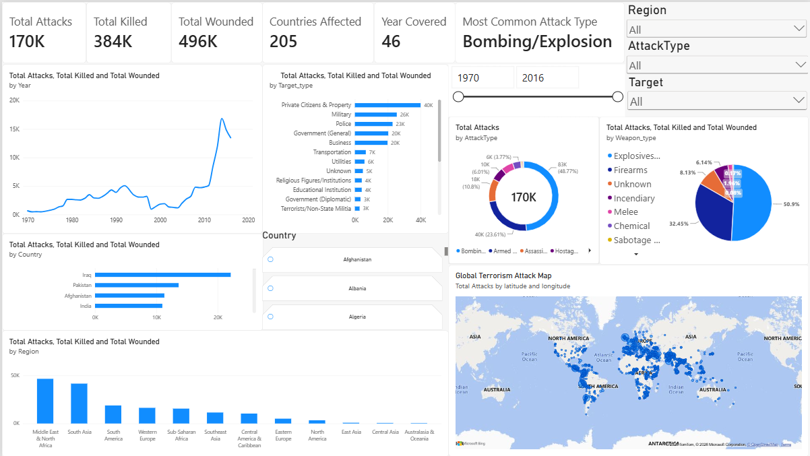

# 🌍 Global Terrorism Analysis — Power BI Dashboard

An interactive **Power BI dashboard** designed to analyze global terrorism activity through trends, attack patterns, casualties, geographic distribution, and affected regions.

This project demonstrates practical **Data Cleaning, Data Analysis, Data Visualization, and Business Intelligence** skills using Python and Microsoft Power BI.

---

## 📊 Dashboard Preview



> **Interactive Power BI dashboard for exploring terrorism trends and patterns across years, regions, countries, attack types, targets, weapons, and geographic locations.**

---

## 🎯 Project Objective

The objective of this project is to transform a large and imperfect terrorism dataset into a clean, interactive, and easy-to-understand analytical dashboard.

The dashboard helps explore questions such as:

* How has recorded attack activity changed over time?
* Which countries and regions have the highest number of recorded attacks?
* Which attack types occur most frequently?
* What types of targets are most frequently represented?
* Which weapon categories are most commonly recorded?
* How are recorded attacks geographically distributed?
* How do casualties vary across time and other categories?

---

## 🛠️ Tools & Technologies

| Tool                   | Purpose                                      |
| ---------------------- | -------------------------------------------- |
| **Python**             | Data cleaning and preprocessing              |
| **Pandas**             | Data manipulation and missing-value analysis |
| **Jupyter Notebook**   | Data preparation and exploration             |
| **Microsoft Power BI** | Dashboard development and visualization      |
| **DAX**                | Measures and calculated metrics              |
| **CSV**                | Cleaned data storage                         |

---

## 🧹 Data Cleaning & Preparation

The dataset was examined and prepared before building the dashboard.

Key data preparation activities included:

* Inspecting data types
* Identifying missing values
* Calculating missing-value percentages
* Investigating missing categorical and numerical data
* Handling text-based missing values where appropriate
* Preserving missing geographic coordinates rather than creating artificial locations
* Checking categorical distributions
* Reviewing attack, target, and weapon categories
* Exporting the cleaned dataset to CSV for Power BI

### Example cleaned dataset

```text
cleaned_terrorism_data.csv
```

---

## 📌 Key Performance Indicators (KPIs)

The dashboard includes the following summary metrics:

* **Total Attacks**
* **Total Killed**
* **Total Wounded**
* **Countries Affected**
* **Years Covered**
* **Most Common Attack Type**

These KPIs are created using Power BI measures so that they dynamically respond to dashboard filters.

---

## 📈 Dashboard Visualizations

### 1. Attacks Over Time

**Visual:** Line Chart

Shows how the number of recorded attacks changes across years.

**Fields:**

* X-axis → `Year`
* Y-axis → `Total Attacks`

---

### 2. Top 10 Countries by Attacks

**Visual:** Horizontal Bar Chart

Displays the countries with the highest number of recorded attacks.

**Fields:**

* Y-axis → `Country`
* X-axis → `Total Attacks`

---

### 3. Attacks by Region

**Visual:** Bar/Column Chart

Compares recorded attack activity across geographic regions.

**Fields:**

* Axis → `Region`
* Values → `Total Attacks`

---

### 4. Attack Type Analysis

**Visual:** Bar Chart

Shows the distribution of recorded attack types.

**Fields:**

* Y-axis → `AttackType`
* X-axis → `Total Attacks`

---

### 5. Target Type Analysis

**Visual:** Bar Chart

Examines the frequency of different target categories.

**Fields:**

* Y-axis → `Target_type`
* X-axis → `Total Attacks`

---

### 6. Weapon Type Analysis

**Visual:** Bar Chart

Shows the distribution of recorded weapon categories.

**Fields:**

* Y-axis → `Weapon_type`
* X-axis → `Total Attacks`

---

### 7. Geographic Distribution

**Visual:** Map

Uses latitude and longitude to visualize the geographic distribution of recorded attacks.

**Fields:**

* Latitude → `latitude`
* Longitude → `longitude`
* Tooltips → `Country`, `AttackType`, `Killed`, `Wounded`

Missing geographic coordinates were not replaced with artificial average coordinates.

---

## 🎛️ Dashboard Filters

The dashboard includes interactive slicers for:

* **Year**
* **Region**
* **Attack Type**

These allow users to explore different time periods, geographic regions, and attack categories.

---

## 🧮 Key DAX Measures

Examples of measures used in the dashboard:

```DAX
Total Attacks =
COUNTROWS(cleaned_terrorism_data)
```

```DAX
Total Killed =
SUM(cleaned_terrorism_data[Killed])
```

```DAX
Total Wounded =
SUM(cleaned_terrorism_data[Wounded])
```

```DAX
Countries Affected =
DISTINCTCOUNT(cleaned_terrorism_data[Country])
```

```DAX
Years Covered =
DISTINCTCOUNT(cleaned_terrorism_data[Year])
```

These measures allow the dashboard to update dynamically when users interact with slicers and filters.

---

## 📁 Project Structure

```text
Global-Terrorism-Analysis-PowerBI/
│
├── Global Terrorism Analysis Dashboard.pbix
├── cleaned_terrorism_data.csv
├── dashboard-preview.png
└── README.md
```

> The CSV can be omitted from the repository when redistribution of the source dataset is not permitted.

---

## 🔍 Skills Demonstrated

This project demonstrates practical skills in:

* Data Cleaning
* Missing Data Analysis
* Pandas
* Python
* Exploratory Data Analysis
* Data Visualization
* Power BI
* DAX Measures
* Dashboard Design
* Geographic Visualization
* Interactive Filtering
* Data Storytelling

---

## 🚀 How to Use

1. Download the `.pbix` file.
2. Open it using **Microsoft Power BI Desktop**.
3. Make sure the required data source is available.
4. Refresh the dataset if necessary.
5. Use the slicers and visuals to explore the dashboard.

---

## 📷 Dashboard Screenshots

### Overview


### Key Visuals

Additional screenshots can be added here to showcase:

* KPI cards
* Attacks over time
* Top countries
* Regional analysis
* Attack type analysis
* Geographic map

---

## 📚 Project Purpose

This project was created as part of my **Data Analytics portfolio** to demonstrate the complete workflow of transforming raw data into an interactive analytical dashboard.

**Workflow:**

```text
Raw Data
   ↓
Data Cleaning with Python & Pandas
   ↓
Data Validation & Exploration
   ↓
Cleaned CSV
   ↓
Power BI Data Model
   ↓
DAX Measures
   ↓
Interactive Dashboard
   ↓
Data Insights
```

---

## 👨‍💻 Portfolio

This project is part of my journey toward becoming a **Data Analyst**, with a focus on:

**Python | SQL | Excel | Power BI | Tableau | Data Visualization**

---

⭐ **If you find this project useful, feel free to explore the repository and dashboard.**
